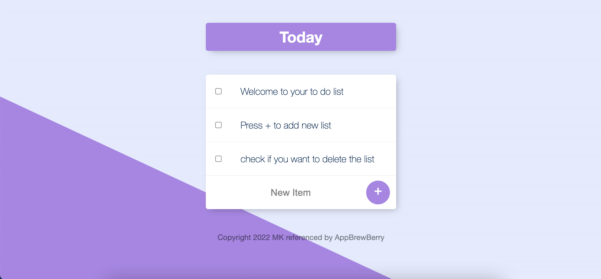

# To do list
This project is intended for practicing and for begineers who want to learn express, ejs and mongo CRUD. You will see dynamic routes, REQUEST (GET, POST) method and mongo CRUD using mongoose package.

## Prequisites

- Node(Install [nodejs](https://nodejs.org/))
- git
- Mongodb(Install [mongo](https://www.mongodb.com/))

## Getting Started

- First, you need to clone the repo: `https://github.com/AungKOO/express---to-do-list.git`
- Run the mongo server (command line will be slightly different based on OS)
- Enter the mongo shell: `mongosh`
- Create database todolistDB: `use todolistDB`
- open the project using code editor
- Run the following command line in your code editor's terminal: `npm i`
- Then Run another following command `npm run start` to start the project
- Open the broswer and type `http://localhost:3000`.

